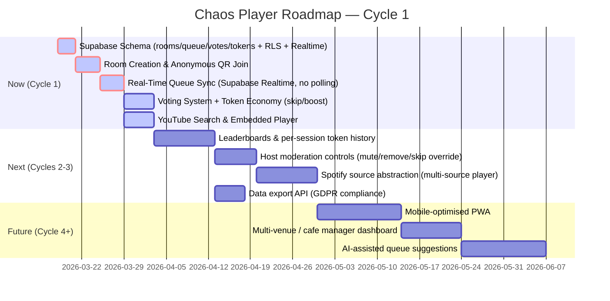

# Chaos Player Roadmap

```mermaid
gantt
  title Chaos Player Roadmap — Cycle 1
  dateFormat YYYY-MM-DD

  section Now (Cycle 1)
    Supabase Schema (rooms/queue/votes/tokens + RLS + Realtime) :crit, active, feat-db, 2026-03-18, 3d
    Room Creation & Anonymous QR Join                           :crit, active, feat-room, after feat-db, 4d
    Real-Time Queue Sync (Supabase Realtime, no polling)        :crit, active, feat-rt, after feat-room, 4d
    Voting System + Token Economy (skip/boost)                  :active, feat-vote, after feat-rt, 5d
    YouTube Search & Embedded Player                            :active, feat-yt, after feat-rt, 5d

  section Next (Cycles 2-3)
    Leaderboards & per-session token history                    :next1, after feat-vote, 10d
    Host moderation controls (mute/remove/skip override)        :next2, after next1, 7d
    Spotify source abstraction (multi-source player)            :next3, after next2, 10d
    Data export API (GDPR compliance)                           :next4, after next1, 5d

  section Future (Cycle 4+)
    Mobile-optimised PWA                                        :future1, after next3, 14d
    Multi-venue / cafe manager dashboard                        :future2, after future1, 10d
    AI-assisted queue suggestions                               :future3, after future2, 14d
```
