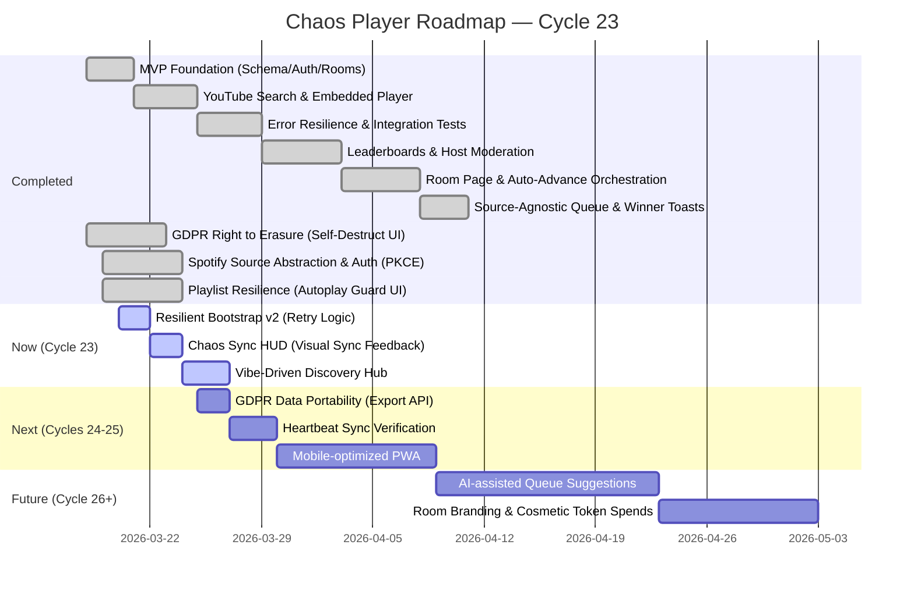

# Chaos Player Roadmap

```mermaid
gantt
  title Chaos Player Roadmap — Cycle 23
  dateFormat YYYY-MM-DD

  section Completed
    MVP Foundation (Schema/Auth/Rooms)          :done, c1, 2026-03-18, 3d
    YouTube Search & Embedded Player            :done, c2, after c1, 4d
    Error Resilience & Integration Tests        :done, c3, after c2, 4d
    Leaderboards & Host Moderation              :done, c4, after c3, 5d
    Room Page & Auto-Advance Orchestration      :done, c5, after c4, 5d
    Source-Agnostic Queue & Winner Toasts       :done, c6, after c5, 3d
    GDPR Right to Erasure (Self-Destruct UI)    :done, c7, 2026-03-18, 5d
    Spotify Source Abstraction & Auth (PKCE)    :done, c18, 2026-03-19, 5d
    Playlist Resilience (Autoplay Guard UI)     :done, c19, 2026-03-19, 5d

  section Now (Cycle 23)
    Resilient Bootstrap v2 (Retry Logic)        :active, c23-1, 2026-03-20, 2d
    Chaos Sync HUD (Visual Sync Feedback)       :active, c23-2, after c23-1, 2d
    Vibe-Driven Discovery Hub                   :active, c23-3, after c23-2, 3d

  section Next (Cycles 24-25)
    GDPR Data Portability (Export API)          :next1, 2026-03-25, 2d
    Heartbeat Sync Verification                 :next2, after next1, 3d
    Mobile-optimized PWA                        :next3, after next2, 10d

  section Future (Cycle 26+)
    AI-assisted Queue Suggestions               :future1, after next3, 14d
    Room Branding & Cosmetic Token Spends       :future2, after future1, 10d
```
