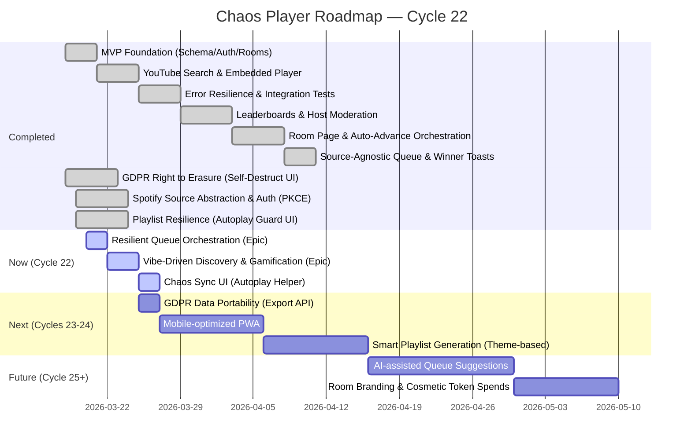

# Chaos Player Roadmap

### Strategic Priorities (Cycle 22)
1.  **Resilience**: Harden the bootstrap process to ensure the "Playlist never starts" bug is eliminated.
2.  **Reach**: Transform the homepage into a dynamic discovery hub with trending "Vibe Score" rooms.
3.  **Engagement**: Deeper gamification via tiered "Vibe Master" rewards (Architect, Legend).
