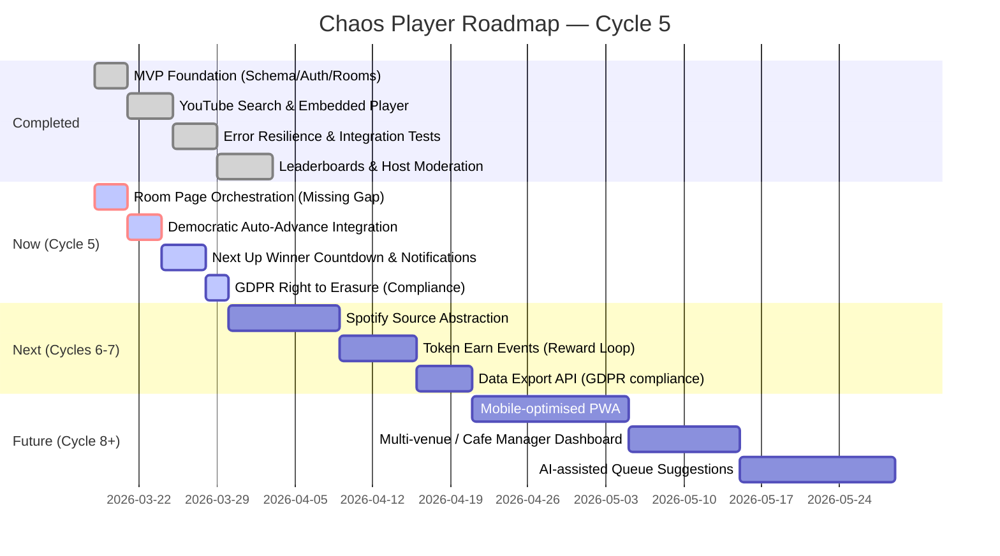

# Chaos Player Roadmap

```mermaid
gantt
  title Chaos Player Roadmap — Cycle 5
  dateFormat YYYY-MM-DD

  section Completed
    MVP Foundation (Schema/Auth/Rooms)          :done, c1, 2026-03-18, 3d
    YouTube Search & Embedded Player            :done, c2, after c1, 4d
    Error Resilience & Integration Tests        :done, c3, after c2, 4d
    Leaderboards & Host Moderation              :done, c4, after c3, 5d

  section Now (Cycle 5)
    Room Page Orchestration (Missing Gap)       :crit, active, c5a, 2026-03-18, 3d
    Democratic Auto-Advance Integration         :crit, active, c5b, after c5a, 3d
    Next Up Winner Countdown & Notifications    :active, c5c, after c5b, 4d
    GDPR Right to Erasure (Compliance)          :active, c5d, after c5c, 2d

  section Next (Cycles 6-7)
    Spotify Source Abstraction                  :next1, after c5d, 10d
    Token Earn Events (Reward Loop)             :next2, after next1, 7d
    Data Export API (GDPR compliance)           :next3, after next2, 5d

  section Future (Cycle 8+)
    Mobile-optimised PWA                        :future1, after next3, 14d
    Multi-venue / Cafe Manager Dashboard        :future2, after future1, 10d
    AI-assisted Queue Suggestions               :future3, after future2, 14d
```
