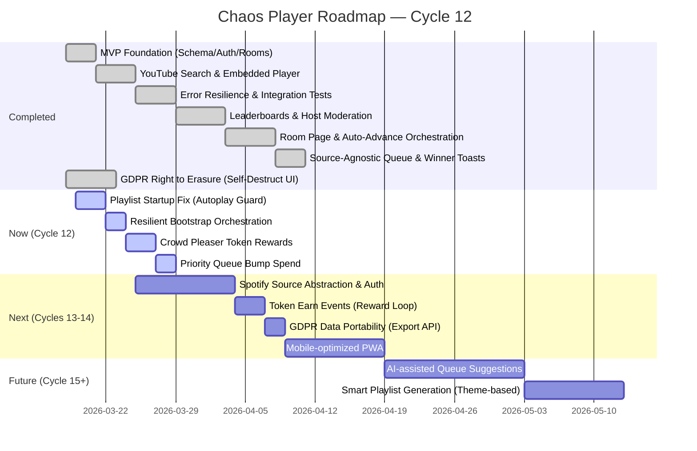

# Chaos Player Roadmap

```mermaid
gantt
  title Chaos Player Roadmap — Cycle 12
  dateFormat YYYY-MM-DD

  section Completed
    MVP Foundation (Schema/Auth/Rooms)          :done, c1, 2026-03-18, 3d
    YouTube Search & Embedded Player            :done, c2, after c1, 4d
    Error Resilience & Integration Tests        :done, c3, after c2, 4d
    Leaderboards & Host Moderation              :done, c4, after c3, 5d
    Room Page & Auto-Advance Orchestration      :done, c5, after c4, 5d
    Source-Agnostic Queue & Winner Toasts       :done, c6, after c5, 3d
    GDPR Right to Erasure (Self-Destruct UI)    :done, c7, 2026-03-18, 5d

  section Now (Cycle 12)
    Playlist Startup Fix (Autoplay Guard)       :active, c12-1, 2026-03-19, 3d
    Resilient Bootstrap Orchestration           :active, c12-2, after c12-1, 2d
    Crowd Pleaser Token Rewards                 :active, c12-3, after c12-2, 3d
    Priority Queue Bump Spend                   :active, c12-4, after c12-3, 2d

  section Next (Cycles 13-14)
    Spotify Source Abstraction & Auth           :next1, 2026-03-25, 10d
    Token Earn Events (Reward Loop)             :next2, after next1, 3d
    GDPR Data Portability (Export API)          :next3, after next2, 2d
    Mobile-optimized PWA                        :next4, after next3, 10d

  section Future (Cycle 15+)
    AI-assisted Queue Suggestions               :future1, after next4, 14d
    Smart Playlist Generation (Theme-based)     :future2, after future1, 10d
```
