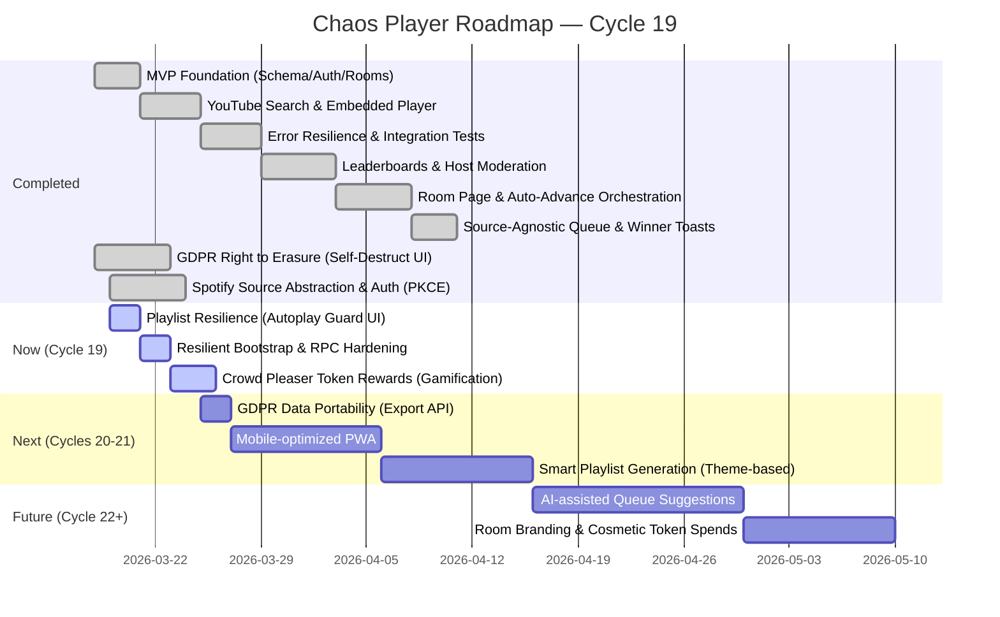

# Chaos Player Roadmap

### Strategic Priorities (Cycle 19)
1. **Seamlessness**: Eliminate the "Playlist never starts" bug through a branded Autoplay Guard UI that turns browser restrictions into an engagement moment.
2. **Fairness**: Harden the democratic bootstrap logic to ensure the highest-voted tracks always start first, even under high concurrency.
3. **Engagement**: Expand the token economy with 'Crowd Pleaser' rewards to encourage high-quality contributions.
